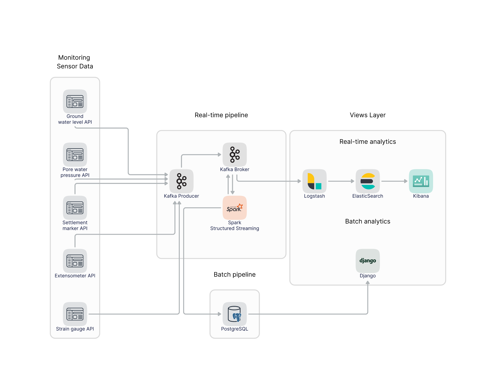
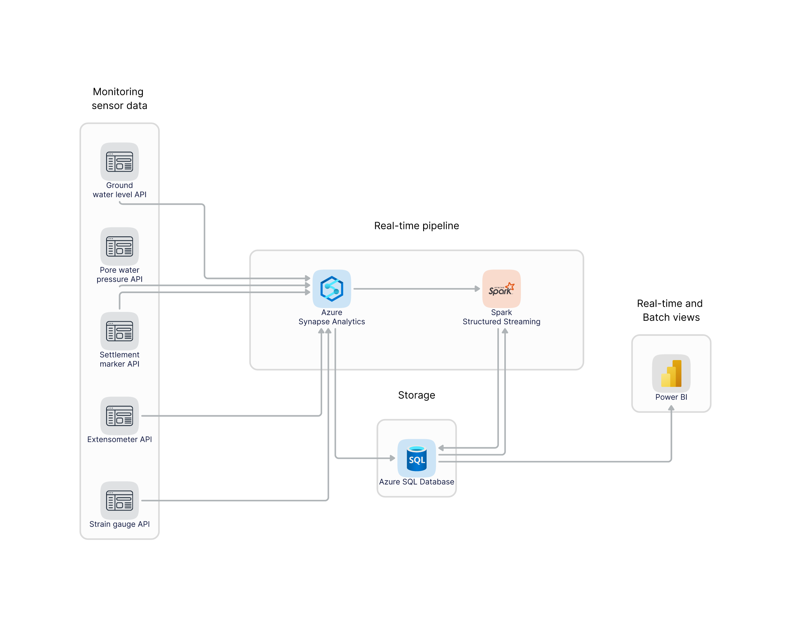

# Kappa Architecture with Kafka, Spark Structured Streaming
My take on implementing a pipeline based on the Kappa Architecture by Jay Kreps to solve a real world problem.

## Problem Statement
With the advent of a low interest rate environment over the past decade, governments all over the world have capitalized on the opportunity to fund a multitude of mega infrastructure projects. The increased number of mega projects has encouraged the construction industry to increasingly incorporate automated processes into their workflows. 

One such area is the monitoring of the ground condition during major underground construction works. Monitoring the state of the ground and structural health of underground projects is mandatory, both from a worker-safety, environmental protection, and the contractual perspective of an asset. The labor-intensive task of site engineers manually taking readings from instruments located over vast spaces and access-limited site geometries is a prime candidate for automation, given the rise in popularity of big data and the advancement of streaming technologies.

This project is centered around implementing a data streaming pipeline which should have the ability to ingest data from a variety of monitoring instrument sources, and feed processed data to both batch and real-time analytics platforms - both of which are critical in billion dollar construction projects.

## Local Architecture

My pipeline is based on the [Kappa Architecture](https://hazelcast.com/glossary/kappa-architecture/), by Jay Kreps. At a high level, raw data is ingested into a `Kafka Broker`, which acts as a messaging service for both producers and consumers. This `Kafka` service is supported by a `Zookeeper` instance.

I have chosen to use `Spark`’s `Structured Streaming` API for my pipeline, as it allows for flexibility to deliver real-time streaming, as well as in micro-batches. `Spark` reads data from a `Kafka` topic for incoming raw data, and once processed, the data is simultaneously written back into a separate outgoing `Kafka` topic for real-time analytics, as well as a `PostgreSQL` database for batch analytics.

My real-time views layer is implemented using the `ELK` stack, which consists of `Logstash`, `Elasticsearch`, and `Kibana`. My batch views layer is implemented using the Python web framework `Django`, and the `JavaScript` visualization library, `Flexmonster`.

### Data Source
As construction mega projects are often shrouded in layers of secrecy and NDA’s, there is no publicly available real-time data source. Therefore, as part of this final project, I have drawn upon my previous experience in the construction industry to deploy a basic REST API which generates pseudo-random monitoring data, within realistic ranges. The data is in `JSON` format, and covers five types of the most frequently used monitoring instruments in the industry. Every `GET` call to this API generates a snapshot in real-time of the current instrument reading, as well as some metadata about the instrument. 

The repository for this API can be found [here](https://github.com/gz101/geotech-parameters-api).

### Stream Ingestion
I have decided to write a simple `Kafka Producer` to collect data from my instrumentation reading API, into a `Kafka topic` for my stream processing application to read from. I have used a `bash` script to automate the running of the script, but the actual implementation is in `Python`, using the module `Kafka-Python`. I would have been interested in exploring the use of `Flume` as an alternative, given more time for this project.

### Stream Processing
The backbone of my streaming pipeline is implemented using the `Spark Structured Streaming` API. I have written this in `Scala`, and the processing stage includes formatting the data, cleaning it from null or empty values, and then aggregating certain instrument reading data. The condition for aggregating data is when the same instrument emits data in close intervals ~10 second windows. This does not occur frequently, but is possible due to the randomness built into my data source, mimicking the real world. In industry, these close-interval reading values are often averaged out and considered as a single data point, and this is what my streaming application does as well.

### Processed Data Storage
Once the raw data has been processed, Spark writes the transformed data to `Kafka` topics for real-time data analytics, and a `PostgreSQL` for persistent storage and batch analytics. There are five different `Kafka` topics this processed data is written to, one for each instrument type.

### Data Visualizations
For the real-time visualization layer, `Logstash` consumes data from all five `Kafka` topics, and the data is stored and indexed by `Elasticsearch`. `Kibana` is the visualization tool from which dashboards can be created based on `Elasticsearch` data. The dashboard data updates in real-time, and the trigger limits can be used as an alerting tool for engineers to decide which instrument data to watch more closely. For batch analytics, I have decided to use `Django` as my application engine due to its simple integration with the `PostgreSQL` database used to store processed data. The `PostgreSQL` data is then fed into the frontend using the `JavaScript` library, `Flexmonster`. A user is able to view the history of all instruments over time, and single out individual instruments where more attention is warranted.

## Cloud Architecture

### Pipeline Details
I have chosen to use the `Azure Synapse Analytics` platform to scale my pipeline. There are similar alternaties from the `AWS` and `GCP` platforms. `Synapse` does most of the heavy lifting in pulling in the external API data and storing the raw data. `Synapse` is also able to run `Spark` jobs which made it a simple process for me to deploy my `Scala` streaming application. It also has a simple integration interface with the `Azure SQL Database` and `PowerBI` for both real-time and batch visualizations.

The pipeline `yaml` file is included within this repo if you would like to take a look at the structure of my pipeline for your own stream processing application.

## Usage
The following steps detail how to run this project locally.
1. From the root directory, run the `bash` script `init.sh`. This compiles the Spark application `jar` file written in `Scala`, and starts all the required `Docker` containers.
2. Submit the `Spark` job by running the following commands:
    - `docker exec -it spark-master /bin/bash` to enter into the `Spark` container.
    - `./opt/spark/bin/spark-submit --class StreamHandler --master local[*] --packages org.apache.spark:spark-sql-kafka-0-10_2.13:3.2.1 /opt/spark-apps/2022SpringSparkJob.jar` to run the `Spark` job.
3. Start the `Kafka Producer` by running the `bash` script `run.sh`.
4. (Optional) Inspect the real-time streaming output data and created `Kafka` topics in the `Kafka Broker` by entering into the `Kafka` container with `docker exec -it kafka /bin/sh`
    - `kafka-topics.sh --list --zookeeper zookeeper:2181`
    - `kafka-console-consumer.sh --bootstrap-server localhost:9092 --topic water_standpipe --from-beginning`
    - `kafka-console-consumer.sh --bootstrap-server localhost:9092 --topic piezometer --from-beginning`
    - `kafka-console-consumer.sh --bootstrap-server localhost:9092 --topic settlement_marker --from-beginning`
    - `kafka-console-consumer.sh --bootstrap-server localhost:9092 --topic extensometer --from-beginning`
    - `kafka-console-consumer.sh --bootstrap-server localhost:9092 --topic strain_gauge --from-beginning`
5. (Optional) Inspect the `PostgreSQL` database streaming output data by entering into the `PostgreSQL` container with `docker exec -it postgres sh`
    - `psql -U postgres monitoring -W ` to login to the database.
    - `SELECT COUNT(*) FROM record ;`
    - `SELECT * FROM record WHERE instrument='water_standpipe' LIMIT 5 ;`
    - `SELECT * FROM record WHERE instrument='piezometer' LIMIT 5 ;`
    - `SELECT * FROM record WHERE instrument='settlement_marker' LIMIT 5 ;`
    - `SELECT * FROM record WHERE instrument='extensometer' LIMIT 5 ;`
    - `SELECT * FROM record WHERE instrument='strain_gauge' LIMIT 5 ;`
6. (Optional) Inspect `Elasticsearch` to ensure it works by visiting `http://localhost:9200/`.
7. The real-time `Kibana` visualization dashboard can be accessed using `http://localhost:5601/`.
8. The batch data `Django` + `Flexmonster` visualization dashboard can be accessed using `http://localhost:8000/dashboard/`.

## Demo
See this [YouTube link](https://youtu.be/lglQ5YC6C9s) for a brief overview and demo of this project.

## Big Data Technologies Used
- `Zookeeper`
- `Kafka`
- `Spark Structured Streaming`
- `PostgreSQL`
- `Logstash`
- `Elasticsearch`
- `Kibana`
- `Azure Synapse Analytics`
- `PowerBI`
